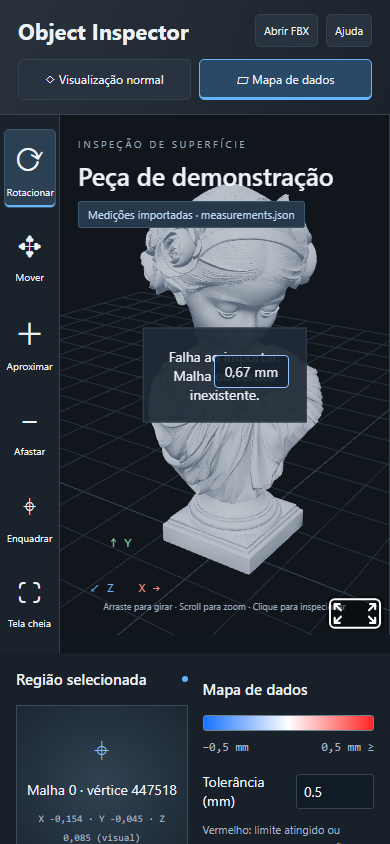

# Object Inspector: um visualizador web estático para mapas de calor de desvio geométrico em superfícies 3D


Demonstração: [lianeheidemann.github.io/porvelain-inspection-v2](https://lianeheidemann.github.io/object-inspector/)

---

## Resumo

A inspeção dimensional de objetos e peças fabricadas produz medições de desvio que, isoladas em tabelas, são difíceis de relacionar com a região física da peça. Este trabalho apresenta o **Object Inspector**, um visualizador web estático que projeta medições de desvio geométrico (em mm) sobre os vértices de um modelo FBX e as exibe como um mapa de calor normalizado pela tolerância. O sistema roda inteiramente no navegador, sem etapa de build, sem servidor de processamento e sem envio de arquivos, usando A-Frame 1.7.0 sobre Three.js r173. Oferece três modos de comparação (atual, referência e diferença), uma linha do tempo de análises, consulta por vértice e importação de medições em um esquema JSON validado. O aplicativo **não calcula defeitos**: ele apenas representa dados fornecidos externamente, já calibrados e alinhados. Sem dados importados, um campo sintético determinístico é usado somente para demonstração.

**Palavras-chave:** inspeção dimensional; visualização científica; mapa de calor; WebGL; controle de qualidade; inspeção 3D.


*Figura 1. Interface principal com o modelo padrão (`rosy-bust.fbx`) e o mapa de severidade demonstrativo.*


<!--
---

## 1. Introdução

Em processos de controle de qualidade de peças fabricadas, o desvio entre a superfície medida e uma referência é normalmente obtido por digitalização 3D seguida de alinhamento. O passo seguinte, a interpretação, depende de enxergar *onde* os desvios ocorrem e *quanto* eles representam em relação à tolerância especificada.

Este projeto trata exclusivamente desse passo de visualização. Os objetivos são:

1. exibir valores de desvio sobre a própria geometria da peça, sem conversão prévia do arquivo FBX;
2. manter uma escala de cores fixa e explícita, ancorada na tolerância, para permitir comparar análises entre si;
3. preservar o valor numérico original de cada ponto, independentemente da saturação da cor;
4. funcionar como página estática, de forma reproduzível e sem dependências de rede em tempo de execução.

## 2. Materiais e métodos

### 2.1 Ambiente e arquitetura

| Componente | Versão / origem | Função |
|---|---|---|
| A-Frame | 1.7.0 (vendorizado) | cena, câmera e renderização WebGL |
| Three.js | r173 (interno ao A-Frame) | geometria, raycasting e cores por vértice |
| FBXLoader, NURBS, fflate | dependências oficiais do Three.js r173 | leitura direta de FBX |
| JavaScript modular | ES modules, sem bundler | lógica do aplicativo em módulos ([js/](js/), ver tabela 2) |

Os carregadores foram adaptados para importar `AFRAME.THREE`, o que evita uma segunda instância do Three.js na página. Todas as bibliotecas estão em [assets/vendor](assets/vendor); nenhuma CDN é consultada durante a execução.

Tabela 2. Módulos do aplicativo.

| Módulo | Responsabilidade |
|---|---|
| [app.js](js/app.js) | ponto de entrada; carrega o modelo, importa medições e liga os painéis |
| [state.js](js/state.js) | estado compartilhado (modelo, malhas, dados, modo, quadro, seleção) |
| [dom.js](js/dom.js) | utilitários de interface (`$`, formatação, status, tolerância) |
| [camera.js](js/camera.js) | câmera orbital: rotação, deslocamento e zoom |
| [controls.js](js/controls.js) | ponteiro, roda do mouse, teclado e barra de ferramentas |
| [model.js](js/model.js) | leitura, normalização e descarte de FBX |
| [dataset.js](js/dataset.js) | índice das medições e leitura dos valores por vértice |
| [validation.js](js/validation.js) | validação do JSON de medições (sem dependência do navegador) |
| [heatmap.js](js/heatmap.js) | escala de cores e campo sintético (funções puras) |
| [map.js](js/map.js) | aplicação do mapa nas malhas e legenda |
| [selection.js](js/selection.js) | seleção de vértice, marcador e painel de leitura |
| [timeline.js](js/timeline.js) | linha do tempo e reprodução automática |

### 2.2 Modelo geométrico

O FBX é carregado diretamente e percorrido na ordem de travessia do FBXLoader r173, o que define o índice de cada malha. Para a visualização, o modelo é centralizado e reescalado. Por isso, as coordenadas exibidas são **visuais** e não correspondem a milímetros físicos. Resolução, material e escala física não são inferidos.

### 2.3 Grandeza representada e normalização

Seja $d_v$ o desvio geométrico, em mm, associado ao vértice $v$ e $\tau > 0$ a tolerância. A severidade é definida como

$$
s_v = \min\!\left(1,\ \frac{|d_v|}{\tau}\right).
$$

A cor é obtida por interpolação linear entre seis paradas igualmente espaçadas em $s \in \{0;\ 0{,}2;\ 0{,}4;\ 0{,}6;\ 0{,}8;\ 1\}$, indo do azul ($s = 0$) ao vermelho ($s = 1$, tolerância atingida ou excedida). Uma escala alternativa, *viridis*, de luminância monotônica e mais legível para pessoas com daltonismo, pode ser escolhida no painel; nela o limite aparece em amarelo. A escala é a mesma em todos os quadros. O valor $d_v$ original continua disponível no painel de consulta, mesmo quando a cor satura.

A tolerância padrão, $\tau = 1$ mm, é apenas demonstrativa e deve ser substituída pela especificação da peça. O sistema não faz classificação automática de aprovação ou reprovação.

### 2.4 Modos de comparação

- **Atual:** $d_v^{(k)}$ do quadro $k$ selecionado.
- **Referência:** $d_v^{\text{ref}}$ informado no arquivo importado (no modo demonstrativo, a referência é o primeiro quadro).
- **Diferença:** $\Delta_v = d_v^{(k)} - d_v^{\text{ref}}$, representada em escala divergente azul–branco–vermelho no intervalo $[-\tau, +\tau]$.

Vértices sem medição são exibidos em cinza. Não há estimativa de valores ausentes. A GPU interpola as cores entre os vértices de cada face, mas essa interpolação é apenas visual e não constitui nova medição.

### 2.5 Consulta pontual

Um clique dispara um raio a partir da câmera. Entre os três vértices da face atingida, é selecionado o mais próximo do ponto de interseção, e o painel mostra malha, índice do vértice, valor em mm, severidade em percentual de $\tau$ e confiança, quando informada. A consulta sempre retorna o valor de um vértice, nunca um valor interpolado.

### 2.6 Campo sintético de demonstração

Sem medições importadas, o mapa é gerado por uma soma determinística de três gaussianas sobre as posições normalizadas $\mathbf{p}$:

$$
d(\mathbf{p}, k) = 0{,}04 + \sum_{i=1}^{3} h_i\,(1 + 0{,}07k)\,
\exp\!\left(-\frac{\lVert \mathbf{p} - \mathbf{c}_i - 0{,}015k\,\hat{\mathbf{x}} \rVert^2}{2 r_i^2}\right),
\qquad k = 0,\dots,4.
$$

| $i$ | centro $\mathbf{c}_i$ | raio $r_i$ | amplitude $h_i$ |
|---|---|---|---|
| 1 | (0,38; 0,55; 0,35) | 0,22 | 1,15 |
| 2 | (−0,45; 0,20; −0,10) | 0,32 | 0,65 |
| 3 | (0,10; −0,35; 0,40) | 0,20 | 0,85 |

Os cinco quadros resultantes são simulações e **não têm significado temporal de inspeção**.

### 2.7 Esquema de dados de entrada

As medições são importadas em JSON e associadas aos vértices pelos índices da geometria FBX carregada, antes de qualquer mudança de topologia:

```json
{
  "unit": "mm",
  "mapping": "vertex-index",
  "model": { "meshes": [ { "vertices": 674994 } ] },
  "frames": [
    { "id": "Inspeção 1", "samples": [
      { "mesh": 0, "vertex": 0, "value": 0.12, "confidence": 0.94 }
    ] }
  ],
  "reference": { "samples": [
    { "mesh": 0, "vertex": 0, "value": 0.05 }
  ] }
}
```

`model`, `reference` e `confidence` são opcionais, sendo que `confidence` deve estar em $[0, 1]$. O arquivo é rejeitado por inteiro quando contém unidade ou mapeamento diferentes, `id` de quadro repetido, malha ou vértice inexistente, valor não finito, confiança fora do intervalo ou amostra duplicada. Importar um novo FBX descarta as medições anteriores.

A correspondência entre os dados e o FBX **não é verificável apenas pelos índices**. Quando presente, `model` informa o número de vértices de cada malha do modelo usado na medição, e o arquivo é recusado se esses números não coincidirem com o modelo carregado. Essa checagem detecta reexportações e simplificações, mas não substitui a responsabilidade do produtor dos dados de garantir que eles foram calculados sobre o mesmo arquivo e já estão calibrados e alinhados.

## 3. Resultados

O sistema resultante é uma página estática publicada no GitHub Pages que:

- carrega o modelo padrão e outros FBX locais escolhidos pelo usuário, sem envio a servidor;
- alterna entre os modos de visualização da superfície (mapa de calor e aparência original);
- permite girar, deslocar e aproximar a peça por mouse, toque ou teclado (setas, +/− e R);
- percorre a linha do tempo de análises, manualmente ou em reprodução automática;
- recalcula as cores quando a tolerância ou a escala de cores é alterada;
- anuncia a seleção de vértice e a troca de quadro a leitores de tela.



*Figura 2. Layout em viewport de 390 × 844 px, sem rolagem horizontal.*

### 3.1 Verificação

Os testes unitários (`npm test`, em [tests/](tests/)) cobrem a escala de cores, o campo sintético e cada regra de validação do JSON. A verificação funcional é automatizada em [docs/scripts/verify.py](docs/scripts/verify.py) com Playwright/Chromium. Os dois rodam a cada *push* no GitHub Actions ([ci.yml](.github/workflows/ci.yml)). O roteiro de navegador confirma que:

1. o modelo carrega sem erros de página e o nome do arquivo aparece no cabeçalho;
2. a troca de escala de cores atualiza a nota da legenda;
3. a legenda acompanha a tolerância (0,5 mm) e a linha do tempo indica o quadro correto (`4 / 5`);
4. o clique seleciona um vértice da malha 0 e a seleção é anunciada;
5. um JSON válido é importado e o valor (0,87 mm), a confiança (94%) e a diferença em relação à referência (0,67 mm) são exibidos corretamente;
6. um JSON de outro modelo (campo `model`) e um JSON com índice inválido são rejeitados sem alterar o estado anterior;
7. a página não apresenta rolagem horizontal em largura de celular.

Os experimentos descritos verificam a **corretude da visualização** e não a acurácia metrológica, que depende inteiramente da origem dos dados.

## 4. Limitações

- Não há cálculo de desvio, alinhamento automático nem interpolação espacial de medições.
- O mapeamento por índice de vértice é frágil diante de reexportação ou retopologia do modelo. O campo `model` detecta a maioria desses casos, mas não os corrige.
- A confiança é apenas exibida. Não há propagação de confiança para o modo diferença.
- FBX com texturas externas exigem que essas texturas estejam em caminhos acessíveis.
- A tolerância é única para a peça inteira e não varia por região.

## 5. Trabalhos futuros

O roteiro detalhado, com o status de cada item, está em [docs/README.md](docs/README.md). Em resumo: mapeamento por coordenadas ou UV em vez de índices, tolerâncias por região, exportação de relatórios e suporte direto a nuvens de pontos de digitalização.

## 6. Reprodutibilidade

```powershell
python -m http.server 8000 --bind 127.0.0.1
```

Acesse http://127.0.0.1:8000 (o protocolo `file://` não é suportado). Para checar a sintaxe e rodar os testes:

```bash
for f in js/*.js; do node --check $f; done
npm test                                     # testes unitários (Node 22+)
python docs/scripts/verify.py                # teste de navegador; requer Playwright e Chromium
python docs/scripts/verify.py --screenshots  # idem, regravando as capturas em docs/images
```

## Agradecimentos

A arquitetura foi inspirada em [vehicle-3d-showroom](https://github.com/lianeheidemann/vehicle-3d-showroom).

## Referências

1. A-Frame. *A web framework for building 3D/AR/VR experiences*. Disponível em: https://aframe.io. Licença MIT.
2. Three.js. *JavaScript 3D library*, r173. Disponível em: https://threejs.org. Licença MIT.
3. fflate. *High performance (de)compression in an 8kB package*. Disponível em: https://github.com/101arrowz/fflate. Licença MIT.
4. Playwright. *Reliable end-to-end testing for modern web apps*. Disponível em: https://playwright.dev.

## Como citar

```bibtex
@software{heidemann_object_inspector,
  author = {Heidemann, Liane},
  title  = {Object Inspector: um visualizador web estático para mapas de calor de desvio geométrico em superfícies 3D},
  url    = {https://github.com/lianeheidemann/porvelain-inspection-v2},
  year   = {2026}
}
```

## Licença

O código está disponível sob a [licença MIT](LICENSE). Bibliotecas e modelos de terceiros seguem suas respectivas licenças e mantêm seus avisos originais.

-->
