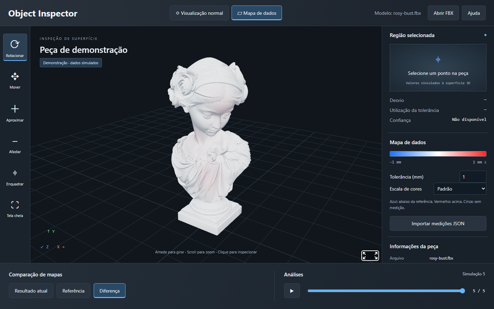
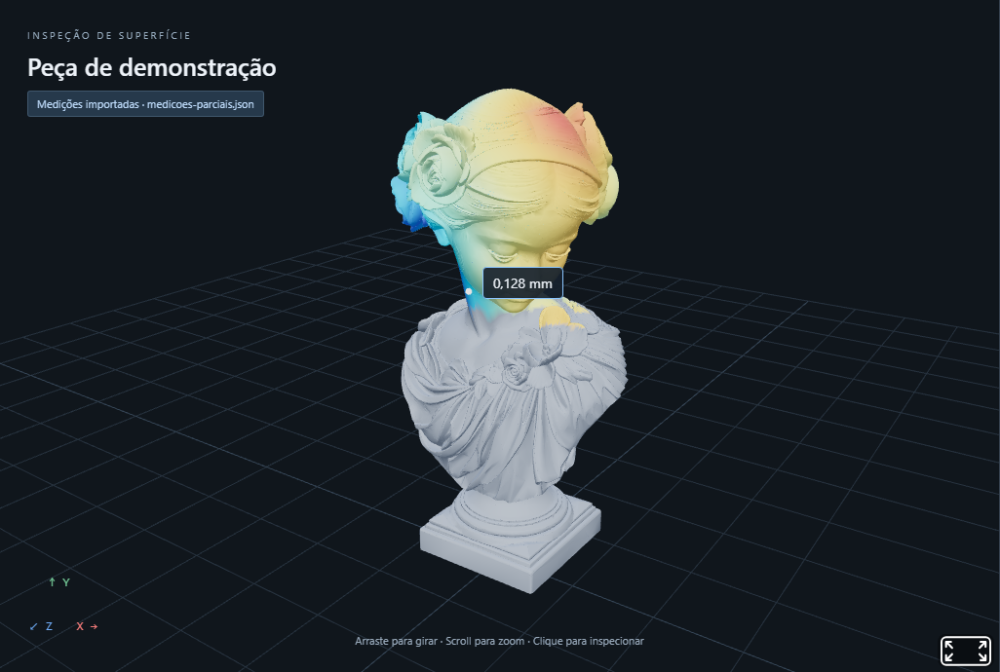
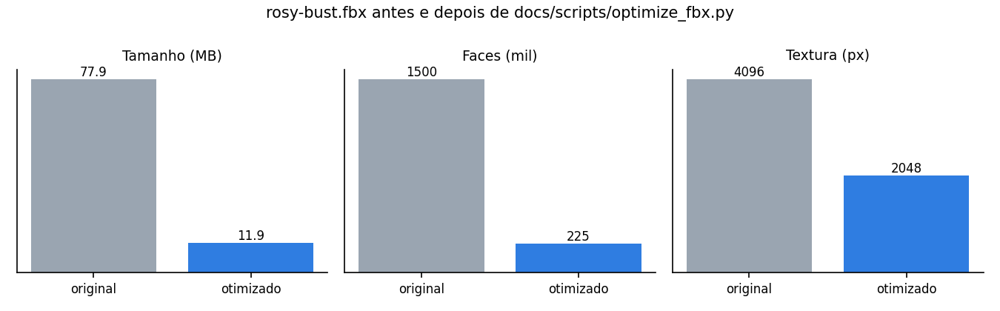
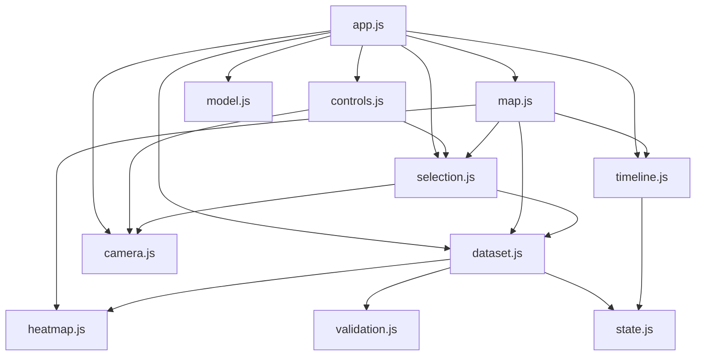
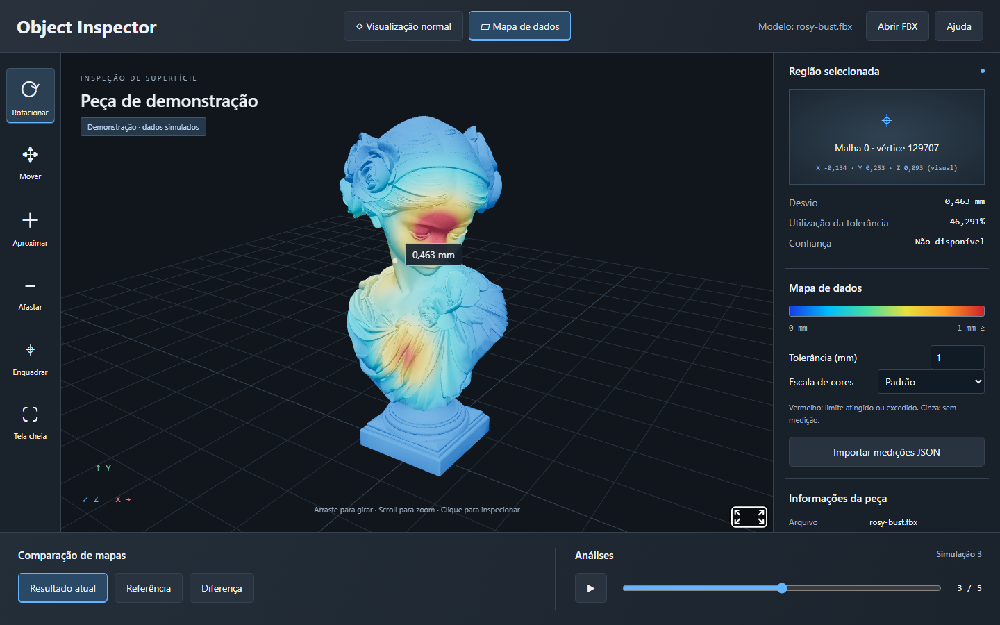
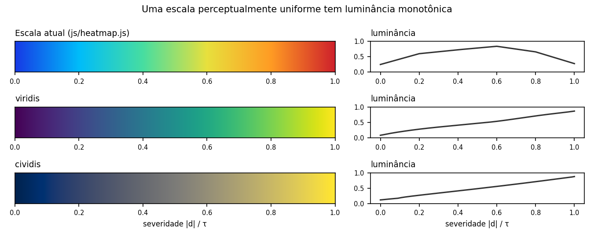
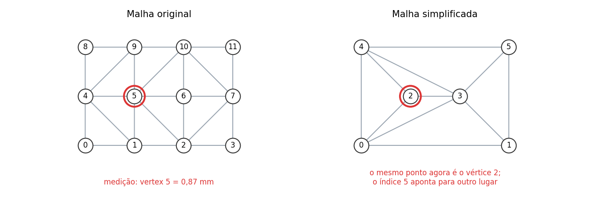

# Próximos passos da implementação

Este documento reúne o que já foi feito e o que falta implementar no **Object Inspector**, em ordem de prioridade. Cada item aponta o trecho do código envolvido e o critério para considerá-lo concluído. A descrição do sistema atual está no [README principal](../README.md).



*Figura 1. Estado atual: modo diferença (quadro 5 menos a referência), em escala divergente de −τ a +τ.*

## Visão geral

| Fase | Foco | Status |
|---|---|---|
| 1 | Desempenho e robustez com dados reais | Concluída |
| 2 | Testes automatizados e integração contínua | Concluída |
| 3 | Organização do código | Concluída (falta só o formatador) |
| 4 | Recursos de análise | **Próxima** · prioridade média |
| 5 | Acessibilidade e experiência de uso | Quase concluída (falta internacionalização) |
| 6 | Integração com o processo de medição | Exploratória |

---

## Fase 1 — Desempenho e robustez com dados reais

### 1.1 Indexar as medições importadas ✅
Antes, cada consulta a um vértice percorria a lista de amostras com `samples.find(...)`, o que tornava cada atualização do mapa O(V × S). Agora `indexDataset`, em [dataset.js](../js/dataset.js), monta na importação um `Map` por quadro (e um para a referência) com chave numérica (malha, vértice), e a consulta passa a ser O(1).



*Figura 2. Importação de centenas de milhares de amostras, só na metade superior do busto. Vértices sem medição aparecem em cinza. Antes do índice, um arquivo desse tamanho travava a página.*

### 1.2 Reaproveitar o buffer de cores ✅
- `paintMeshes`, em [map.js](../js/map.js), cria o atributo `color` uma única vez por malha e depois só reescreve os valores, marcando `needsUpdate`.
- `prepareModel`, em [model.js](../js/model.js), guarda as posições dos vértices em coordenadas do mundo. O campo de demonstração não chama mais `localToWorld` por vértice a cada quadro.
- O campo de tolerância só repinta o mapa 150 ms depois da última tecla.

Resultado: a troca de quadro no modelo padrão (675 mil vértices) caiu de 3,05 s para 0,72 s em média, medida no Chromium sem GPU.

### 1.3 Reduzir o modelo padrão ✅
O `rosy-bust.fbx` original tinha 78 MB e levava cerca de 47 s até aparecer no GitHub Pages, com a tela parada em "Carregando FBX…". O script [optimize_fbx.py](scripts/optimize_fbx.py) gera uma versão para a web com o modificador *Decimate* do Blender e texturas em JPEG de 2048 px. A página agora também mostra o progresso do download.



*Figura 3. Tamanho do arquivo, número de faces e resolução das texturas antes e depois da otimização.*

```powershell
& "C:\Program Files\Blender Foundation\Blender 5.1\blender.exe" --background `
  --python docs/scripts/optimize_fbx.py -- original.fbx assets/models/rosy-bust.fbx 0.15 2048
```

> **Atenção:** simplificar o modelo renumera os vértices. Qualquer JSON de medição gerado para a versão anterior deixa de valer (ver 1.4 e 6.1).

### 1.4 Verificar a correspondência entre medições e modelo ✅
O JSON aceita um campo opcional `model: { "meshes": [{ "vertices": N }, ...] }`. Quando presente, [validation.js](../js/validation.js) recusa o arquivo se o número de malhas ou de vértices não coincidir com o modelo carregado, com uma mensagem que indica a malha e as contagens esperada e encontrada. Isso detecta, por exemplo, medições feitas para o `rosy-bust.fbx` anterior à otimização.

---

## Fase 2 — Testes automatizados e integração contínua ✅

- **Testes unitários:** `npm test` roda os arquivos de [tests/](../tests/) com o executor nativo do Node (sem dependências): 19 testes para `colorFor`, `demoValue`, `gradientCss` e todas as regras de `validateDataset`. Para isso, a validação foi movida para [validation.js](../js/validation.js), que não depende de `AFRAME`. O [dataset.js](../js/dataset.js) a reexporta.
- **Integração contínua:** [ci.yml](../.github/workflows/ci.yml) roda, a cada *push* na `main` e a cada *pull request*, a checagem de sintaxe, os testes unitários e o [verify.py](scripts/verify.py) no Chromium.
- **Testes sem efeitos colaterais:** o `verify.py` só regrava `images/desktop.png` e `images/mobile.png` com `--screenshots`.

---

## Fase 3 — Organização do código ✅

O antigo `app.js` foi dividido em módulos com responsabilidades separadas (tabela 2 do [README principal](../README.md)). O número de quadros de demonstração virou a constante `DEMO_FRAMES`, em [state.js](../js/state.js). As dependências entre os módulos não formam ciclos:



*Figura 4. Dependências entre os módulos (`dom.js` e `state.js`, usados por quase todos, aparecem só em parte).*

Pendente:

- Adotar um formatador (por exemplo, Prettier), mantendo os arquivos de terceiros de `assets/vendor` fora dele.

---

## Fase 4 — Recursos de análise · próxima

Implementar na ordem abaixo, um recurso por vez. Todos os itens abaixo continuam apenas **representando** os dados fornecidos, sem calcular defeitos nem aprovar ou reprovar peças.



*Figura 5. Hoje a análise é feita ponto a ponto: o clique mostra desvio, utilização da tolerância e confiança de um único vértice.*

1. **Estatísticas descritivas** do quadro atual: mínimo, máximo, média, desvio-padrão, percentual de vértices medidos e percentual acima de τ.
2. **Histograma** dos desvios, usando a mesma escala de cores do mapa.
3. **Exportação** de um relatório (CSV dos pontos e captura da vista atual), com a tolerância, o quadro e a origem dos dados registrados.
4. **Tolerâncias por região**, informadas no JSON (por malha ou por grupo de vértices), substituindo o valor único atual.
5. **Visualização da confiança**, por exemplo com opacidade ou hachura nas regiões de baixa confiança, além do valor no painel.
6. **Escala física opcional:** permitir informar o fator de escala do modelo para exibir as coordenadas em mm, em vez de coordenadas visuais.

---

## Fase 5 — Acessibilidade e experiência de uso

- **Paleta de cores ✅:** a escala padrão vai do azul ao vermelho passando por verde e amarelo, como o *jet*. A luminância sobe e depois desce (Figura 6), então valores baixos e altos parecem igualmente escuros em tons de cinza ou para pessoas com daltonismo. O painel "Mapa de dados" agora oferece a escala *viridis*, e a legenda e a nota de cor acompanham a escolha.

  

  *Figura 6. A escala padrão não tem luminância monotônica; viridis e cividis têm.*

- **Leitores de tela ✅:** uma região `aria-live` anuncia a seleção de vértice e a troca manual de quadro. A reprodução automática não é anunciada, para não gerar ruído. Ainda falta revisar a ordem de foco do teclado.
- **Nome do modelo ✅:** o cabeçalho e o título do palco acompanham o arquivo FBX carregado.
- **Internacionalização:** separar os textos da interface para permitir uma versão em inglês.

---

## Fase 6 — Integração com o processo de medição (exploratória)

Estes itens ampliam o escopo do projeto e precisam ser discutidos antes de serem implementados.

### 6.1 Mapeamento por coordenadas
Hoje cada medição se liga a um vértice pelo índice. Basta reexportar ou simplificar o modelo para os índices mudarem e as medições caírem em pontos errados, sem nenhum erro visível (Figura 7).



*Figura 7. Depois da simplificação, o ponto medido como vértice 5 passa a ser o vértice 2.*

A proposta é aceitar amostras com coordenadas (x, y, z) no sistema do modelo e associá-las ao vértice mais próximo, por meio de uma árvore k-d, com uma distância máxima configurável.

### 6.2 Outros formatos
Suportar GLB/glTF diretamente e nuvens de pontos (PLY) vindas de digitalização 3D.

### 6.3 Alinhamento e cálculo de desvio
Calcular o desvio a partir de uma digitalização e de um modelo de referência, por exemplo com alinhamento ICP. Isso muda a natureza do projeto, de visualizador para ferramenta de medição, e exigiria validação metrológica própria. A recomendação é fazer isso em uma ferramenta separada que gere o JSON consumido por este visualizador.

---

## Organização desta pasta

```
docs/
├── README.md            este documento
├── images/              figuras usadas na documentação
└── scripts/             utilitários de teste, captura e preparação de modelos
```

| Script | Uso |
|---|---|
| [verify.py](scripts/verify.py) | teste de navegador com Playwright; com `--screenshots`, regrava `desktop.png` e `mobile.png` |
| [docs_images.py](scripts/docs_images.py) | gera as figuras deste documento (`--no-screenshots` gera só os gráficos) |
| [inspect_bust.py](scripts/inspect_bust.py) | inspeção das malhas e dos materiais do modelo padrão |
| [optimize_fbx.py](scripts/optimize_fbx.py) | simplifica um FBX e reduz suas texturas via Blender |
| [convert_glb_to_fbx.py](scripts/convert_glb_to_fbx.py) | conversão de GLB para FBX via Blender |

Os scripts de navegador esperam o servidor local ativo (`python -m http.server 8000 --bind 127.0.0.1`) e devem ser executados a partir da raiz do repositório.
