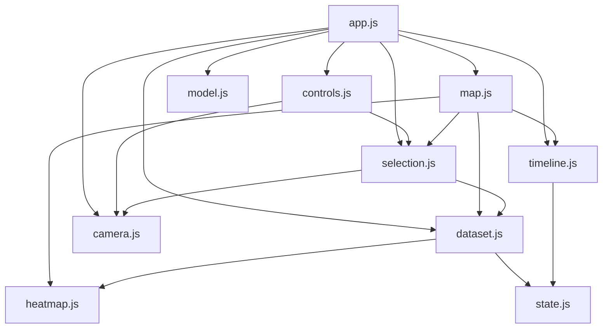

# Próximos passos da implementação

Este documento reúne o que falta implementar no **Object Inspector**, em ordem de prioridade. Cada item aponta o trecho do código envolvido e o critério para considerá-lo concluído. A descrição do sistema atual está no [README principal](../README.md).


*Figura 1. Estado atual: modo diferença (quadro 5 menos a referência), em escala divergente de −τ a +τ.*

## Visão geral

| Fase | Foco | Status |
|---|---|---|
| 1 | Desempenho e robustez com dados reais | Em andamento (1.1 e 1.3 concluídos) |
| 2 | Testes automatizados e integração contínua | A fazer · prioridade alta |
| 3 | Organização do código | Concluída |
| 4 | Recursos de análise | A fazer · prioridade média |
| 5 | Acessibilidade e experiência de uso | A fazer · prioridade média |
| 6 | Integração com o processo de medição | Exploratória |

---

## Fase 1 — Desempenho e robustez com dados reais

### 1.1 Indexar as medições importadas ✅
Antes, cada consulta a um vértice percorria a lista de amostras com `samples.find(...)`, o que tornava cada atualização do mapa O(V × S). Agora `indexDataset`, em [dataset.js](../js/dataset.js), monta na importação um `Map` por quadro (e um para a referência) com chave numérica (malha, vértice), e a consulta passa a ser O(1).


*Figura 2. Importação de centenas de milhares de amostras, só na metade superior do busto. Vértices sem medição aparecem em cinza. Antes do índice, um arquivo desse tamanho travava a página.*

### 1.2 Reaproveitar o buffer de cores
`paintMeshes`, em [map.js](../js/map.js), cria um `Float32Array` e um `BufferAttribute` novos a cada mudança de tolerância ou de quadro, inclusive durante a reprodução automática.

- Criar o atributo `color` uma única vez por malha, depois só atualizar os valores e marcar `needsUpdate = true`.
- No modo demonstração, guardar as posições em coordenadas do mundo em cache, em vez de chamar `localToWorld` por vértice a cada quadro.
- Aplicar um *debounce* curto ao campo de tolerância.

### 1.3 Reduzir o modelo padrão ✅
O `rosy-bust.fbx` original tinha 78 MB e levava cerca de 47 s até aparecer no GitHub Pages, com a tela parada em "Carregando FBX…". O script [optimize_fbx.py](scripts/optimize_fbx.py) gera uma versão para a web com o modificador *Decimate* do Blender e texturas em JPEG de 2048 px. A página agora também mostra o progresso do download.


*Figura 3. Tamanho do arquivo, número de faces e resolução das texturas antes e depois da otimização.*

```powershell
& "C:\Program Files\Blender Foundation\Blender 5.1\blender.exe" --background `
  --python docs/scripts/optimize_fbx.py -- original.fbx assets/models/rosy-bust.fbx 0.15 2048
```

> **Atenção:** simplificar o modelo renumera os vértices. Qualquer JSON de medição gerado para a versão anterior deixa de valer (ver 1.4 e 6.1).

### 1.4 Verificar a correspondência entre medições e modelo
A correspondência entre o JSON e o FBX hoje não é verificável. Uma solução é adicionar ao esquema um campo opcional que identifique o modelo, por exemplo o número de vértices de cada malha ou um *hash* do arquivo. O aplicativo então recusaria ou alertaria quando os dados não corresponderem ao modelo carregado.

---

## Fase 2 — Testes automatizados e integração contínua

### 2.1 Testes unitários
As funções de [heatmap.js](../js/heatmap.js) e `validateDataset`, de [dataset.js](../js/dataset.js), não dependem do navegador e podem ser testadas com `node --test`:

- `colorFor`: limites 0, τ e acima de τ, valores negativos, `NaN` (cinza) e o modo diferença.
- `demoValue`: determinismo (mesma entrada produz a mesma saída).
- `validateDataset`: cada regra de rejeição (unidade, mapeamento, `id` duplicado, índice inválido, valor não finito, confiança fora de [0, 1] e amostra duplicada), usando malhas falsas `{ geometry: { attributes: { position: { count } } } }`.

`dataset.js` usa `AFRAME.THREE` no nível do módulo. Para importá-lo no Node, mova `validateDataset` para um módulo sem essa dependência ou forneça um `AFRAME` global falso no teste.

### 2.2 Integração contínua
Ainda não existe a pasta `.github/`. Criar um workflow no GitHub Actions que, a cada *push* e *pull request*:

1. rode `node --check` nos módulos e os testes unitários;
2. suba o servidor local e execute [verify.py](scripts/verify.py) com Playwright/Chromium.

### 2.3 Separar teste de geração de capturas
Hoje [verify.py](scripts/verify.py) e [inspect_bust.py](scripts/inspect_bust.py) sobrescrevem `images/desktop.png` e `images/mobile.png` a cada execução. No CI, os testes não devem alterar arquivos versionados. A gravação das capturas pode virar uma opção (`--screenshots`), como já acontece em [docs_images.py](scripts/docs_images.py) com `--no-screenshots`.

---

## Fase 3 — Organização do código ✅

O antigo `app.js` foi dividido em módulos com responsabilidades separadas (tabela 2 do [README principal](../README.md)). O número de quadros de demonstração virou a constante `DEMO_FRAMES`, em [state.js](../js/state.js). As dependências entre os módulos não formam ciclos:



*Figura 4. Dependências entre os módulos (`dom.js` e `state.js`, usados por quase todos, aparecem só em parte).*

Pendente:

- Adotar um formatador (por exemplo, Prettier), mantendo os arquivos de terceiros de `assets/vendor` fora dele.

---

## Fase 4 — Recursos de análise

Todos os itens abaixo continuam apenas **representando** os dados fornecidos, sem calcular defeitos nem aprovar ou reprovar peças.


*Figura 5. Hoje a análise é feita ponto a ponto: o clique mostra desvio, utilização da tolerância e confiança de um único vértice.*

- **Estatísticas descritivas** do quadro atual: mínimo, máximo, média, desvio-padrão, percentual de vértices medidos e percentual acima de τ.
- **Histograma** dos desvios, usando a mesma escala de cores do mapa.
- **Tolerâncias por região**, informadas no JSON (por malha ou por grupo de vértices), substituindo o valor único atual.
- **Visualização da confiança**, por exemplo com opacidade ou hachura nas regiões de baixa confiança, além do valor no painel.
- **Exportação** de um relatório (CSV dos pontos e captura da vista atual), com a tolerância, o quadro e a origem dos dados registrados.
- **Escala física opcional:** permitir informar o fator de escala do modelo para exibir as coordenadas em mm, em vez de coordenadas visuais.

---

## Fase 5 — Acessibilidade e experiência de uso

- **Paleta de cores:** a escala atual vai do azul ao vermelho passando por verde e amarelo, como o *jet*. A luminância sobe e depois desce (Figura 6), então valores baixos e altos parecem igualmente escuros em tons de cinza ou para pessoas com daltonismo. Avaliar *viridis* ou *cividis* como alternativa, mantendo a atual como opção.

  

  *Figura 6. A escala atual não tem luminância monotônica; viridis e cividis têm.*

- **Leitores de tela:** anunciar a seleção de vértice e a troca de quadro em uma região `aria-live`, e revisar a ordem de foco do teclado.
- **Nome do modelo:** o cabeçalho mostra sempre "peça de demonstração", mesmo com outro FBX aberto. Ele deve acompanhar o arquivo carregado.
- **Internacionalização:** separar os textos da interface para permitir uma versão em inglês.

---

## Fase 6 — Integração com o processo de medição (exploratória)

Estes itens ampliam o escopo do projeto e precisam ser discutidos antes de serem implementados.

### 6.1 Mapeamento por coordenadas
Hoje cada medição se liga a um vértice pelo índice. Basta reexportar ou simplificar o modelo para os índices mudarem e as medições caírem em pontos errados, sem nenhum erro visível (Figura 7).


*Figura 7. Depois da simplificação, o ponto medido como vértice 5 passa a ser o vértice 2.*

A proposta é aceitar amostras com coordenadas (x, y, z) no sistema do modelo e associá-las ao vértice mais próximo, por meio de uma árvore k-d, com uma distância máxima configurável.

### 6.2 Outros formatos
Suportar GLB/glTF diretamente e nuvens de pontos (PLY) vindas de digitalização 3D.

### 6.3 Alinhamento e cálculo de desvio
Calcular o desvio a partir de uma digitalização e de um modelo de referência, por exemplo com alinhamento ICP. Isso muda a natureza do projeto, de visualizador para ferramenta de medição, e exigiria validação metrológica própria. A recomendação é fazer isso em uma ferramenta separada que gere o JSON consumido por este visualizador.

---

## Organização desta pasta

```
docs/
├── README.md            este documento
├── images/              figuras usadas na documentação
└── scripts/             utilitários de teste, captura e preparação de modelos
```

| Script | Uso |
|---|---|
| [verify.py](scripts/verify.py) | teste de navegador com Playwright; regrava `desktop.png` e `mobile.png` |
| [docs_images.py](scripts/docs_images.py) | gera as figuras deste documento (`--no-screenshots` gera só os gráficos) |
| [inspect_bust.py](scripts/inspect_bust.py) | inspeção das malhas e dos materiais do modelo padrão |
| [optimize_fbx.py](scripts/optimize_fbx.py) | simplifica um FBX e reduz suas texturas via Blender |
| [convert_glb_to_fbx.py](scripts/convert_glb_to_fbx.py) | conversão de GLB para FBX via Blender |

Os scripts de navegador esperam o servidor local ativo (`python -m http.server 8000 --bind 127.0.0.1`) e devem ser executados a partir da raiz do repositório.
